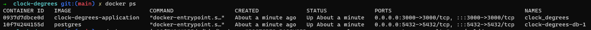
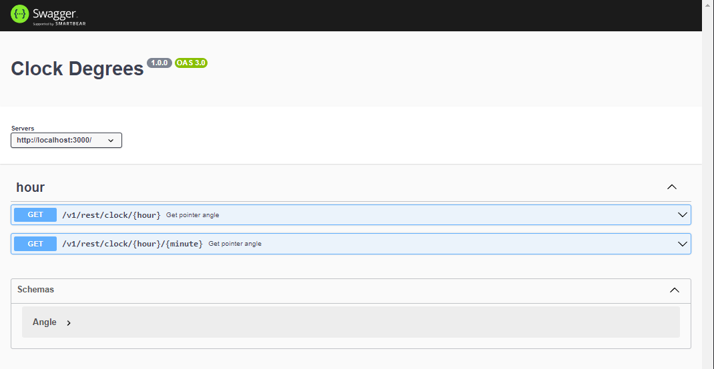

## Description

This project simulates the distance in degrees between two clock pointers, hour and minute. The pointers position are passed via endpoint and the application have to return the minor distance between then in degrees.

ex:

request: 12:30

response:

{
angle: 180
}


### To build project and add husky configuration

(to know more about husky: https://typicode.github.io/husky/#/)

```
$ npm run build
```

### Or if you wanna just create .husky folder with pre-push and pre-commit files

```
$ npm run prepare
```

### To start project from dist folder

```
$ npm run start
```

### To start project from src folder with tsx

```
$ npm run dev
```

### Run all the test suits

```
$ npm test
```

### Select wich suit you wanna run in watch mode or related files uncommited by git

(know more in: https://vitest.dev/guide/)

```
$ npm run test:watch
```

### Run all the tests and generate bunch of informations about project test coverage

```
$ npm run test:coverage
```

### To start project from docker container

(know more in: https://docs.docker.com/get-started/ and https://docs.docker.com/compose/gettingstarted/)

```
$ docker-compose up
```

## Restore database from sql script

This repository comes with a mirror with some data ready to be saved in the database via dumping. The dumping can be by the identification of container ID, then you need to execute a docker ps command.

```
$ docker  ps
```
Output:



Look that container ID will vary each time you type the command **docker-compose up** after a **docker-compose down**, so, is important to remember that you need docker ps to search the containers ID.

Enter in project folder to have access to dump file:

```
$ cd clock-degrees/
```

Now, into project folder you can restore database using container ID in this command:

```
$ docker exec -i <CONTAINER ID> /bin/bash -c "POSTGRES_PASSWORD=posgres psql --username postgres results" < ./sql/dump.sql
```
Output:


Despite of errors warnings, the operation was made successfully, look that the container ID used is correspondent to postgres image that was listed with the last command
## To access application from swagger

After run the application via docker using:

```
$ docker-compose up
```

Open your browser at the address http http://localhost:3000/api, and then you'll can test the application endpoints.





## Project folders schema


```
├─ assets
│  ├─ docker_ps.PNG
│  ├─ dump result.PNG
│  └─ swagger.PNG
├─ prisma
│  ├─ migrations
│  │  ├─ 20230801215253_inital_migration
│  │  │  └─ migration.sql
│  │  └─ migration_lock.toml
│  └─ schema.prisma
├─ private
│  └─ var
│     └─ lib
│        └─ postgresql
│           └─ data
├─ sql
│  └─ dump.sql
├─ src
│  ├─ app.ts
│  ├─ common
│  │  ├─ environment-consts.ts
│  │  └─ swagger.json
│  ├─ config
│  │  └─ client
│  │     └─ client.ts
│  ├─ controllers
│  │  ├─ clock-controller.ts
│  │  └─ handlers
│  │     └─ handles.ts
│  ├─ factories
│  │  └─ factories.ts
│  ├─ index.ts
│  ├─ infra
│  │  ├─ errors
│  │  │  └─ errors.ts
│  │  └─ repositories
│  │     ├─ interfaces
│  │     │  └─ repository-interfaces.ts
│  │     └─ result-repository.ts
│  ├─ middlewares
│  │  └─ validation-middlewares.ts
│  ├─ routes.ts
│  └─ services
│     └─ clock-services.ts
├─ tests
│  ├─ controllers
│  │  └─ clock-controller.int.spec.ts
│  ├─ mocks
│  │  └─ mocks.ts
│  └─ services
│     └─ clock-services.spec.ts
├─ tsconfig-build.json
├─ tsconfig.json
└─ vitest.config.ts
├─ docker-compose.yml
├─ package-lock.json
├─ package.json
├─ .gitignore
├─ .prettierrc.json
├─ Dockerfile
├─ README.md
```
